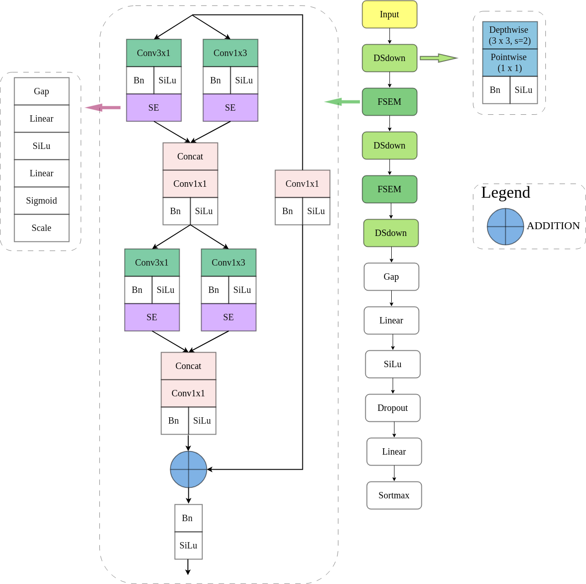

With the increasing demand for efficient spectrum utilization in modern communication systems, waveform classification has become a critical task. This project proposes LFSE-Net, a lightweight deep learning architecture for radar signal classification using spectrogram images. The model leverages depthwise separable convolution, factorized convolution, and Squeeze-and-Excitation (SE) attention to enhance feature extraction while maintaining low computational cost. Additionally, residual connections are employed to improve training stability. Experiments on a dataset of 12 signal classes show that LFSE-Net achieves ~88.85% classification accuracy with only ~36K parameters, demonstrating competitive performance compared to larger models. These results highlight its effectiveness and suitability for deployment in resource-constrained environments.

The dataset is available on [Google Drive](https://drive.google.com/drive/folders/1kgQLFCtKi1ohDzaZ4CYtn9FMye0Zf2Di?usp=sharing).  
Contact: [nguyengiahuy060720@gmail.com](mailto:nguyengiahuy060720@gmail.com) (willing to discuss and collaborate)
